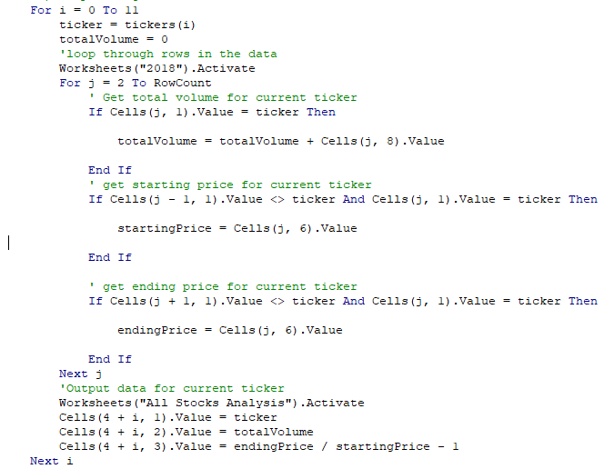
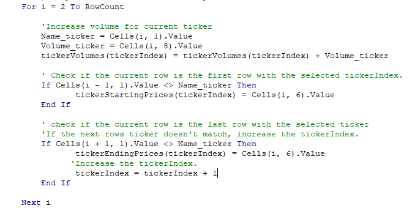
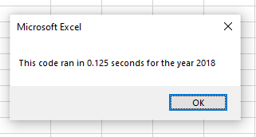
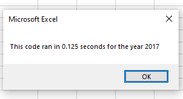

# Stock Analysis Using VBA (VBA challenge)
## Background
In this study stock of the green energy companies is analyzed. The primary purpose of this study is to go over the stock data for 2017 and 2018 to find out the best profitable green company stock. The second purpose of this study is to improve the already existing code to increase performance. These codes are explained in the next section. 
## Results
The data that is available to study green energy companies are included in the Excel file. The data shows each stock information on each day of 2018 and 2019. The ask is to find the first and last date information and calculate the change rate. In addition, the total volume of transaction is asked for as well.

In the initial code that we developed we took each stock ticker and looked through the data to find the relevant information and extract it. This resulted in a nested loop that the first loop chooses a ticker and the second loop goes through the data to find its relevant information.

To refactor the code and improve its performance, the first loop is removed, and arrays are used to store each stock information. In this method we go through the data only once and extract and save the data as we go. This method is computationally faster as it only goes through the data once. Each time that the stock ticker is changed the tickerindex is increased by one. This index is used to store the requested data for each stock.

By refactoring the code, now it can be seen that the code is running way faster. To measure the code performance, the time to run the code is measured. In the next two picture you can see that this code runs very fast for both years.

## Summary
In this study we went through a process to improve a code that had an extra for loop and was going thorough the data several times. In general, one of the advantages of refactoring is the possibility of having a faster code. The disadvantage is that by changing a working code, we might introduce a bug to the code and increase the amount of time that we should put on the code. This is a risk that we should accept to decrease the time needed to go thorough the data.

In the case of the present code, the old code was going through the data for each stock and it was a time consuming process. Increasing the database would have increased our processing time a lot. By optimizing and refactoring the code we were able to reduce the time and optimize the code for larger data sets. There is no major disadvantage for this code, and the only minor disadvantage is that the code is harder to understand by someone who is not familiar with the code and the data. This disadvantage can be solved by additional comments inside the code.

